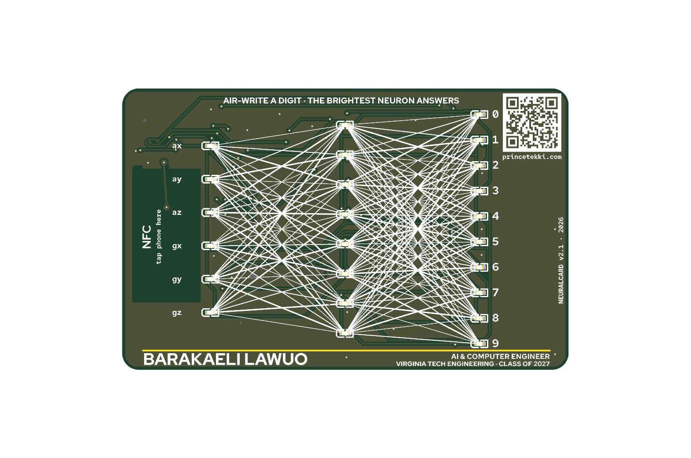
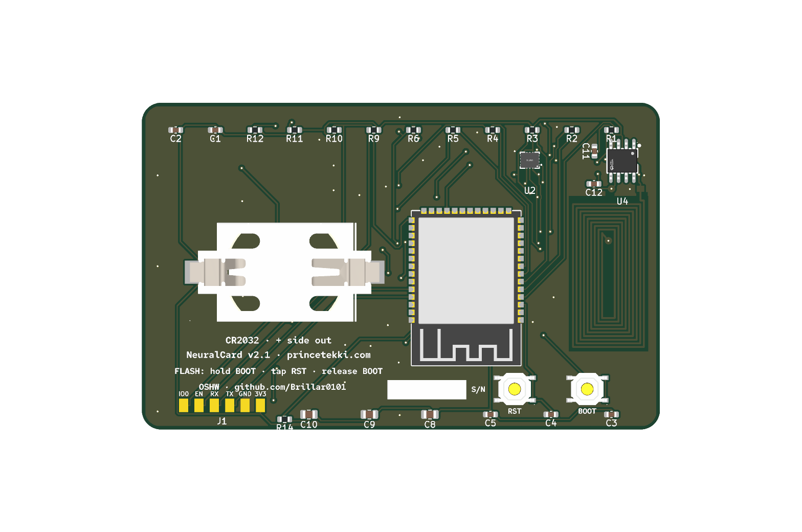

# NeuralCard

A business card that runs a neural network.

It's a credit card sized PCB (85.6 x 54 mm, 0.8 mm thick) with an ESP32-S3,
a 6-axis IMU, and 24 LEDs arranged as the network it actually runs: 6 input
neurons, 8 hidden, 10 output. You hold the card, draw a digit in the air,
and the LEDs light with the real activations as the inference runs. The
brightest output neuron is the guess.

The front artwork is the network diagram. The synapse lines are drawn at
three different stroke weights, the way a trained model's weights differ.
The card also has an NFC tag (ST25DV04KC) with a PCB coil antenna, so
tapping it with a phone opens [princetekki.com/card](https://www.princetekki.com/card)
and offers my contact as a vCard. That part works even with a dead battery,
since the tag is powered by the phone's field.




## Hardware

- ESP32-S3-WROOM-1 (radio off, coin cell life)
- LSM6DS3TR-C accelerometer + gyro on I2C. Its six axes map one to one
  onto the six input neurons.
- 24 red LEDs charlieplexed on 6 GPIO, software PWM for the glow
- ST25DV04KC dynamic NFC tag, 9-turn coil etched on the back copper,
  tuned with a single external cap against the chip's internal 28.5 pF
- CR2032 coin cell. No USB connector: you flash once through six UART
  pads with a serial adapter, then it runs on the coin.

Runs on a 2-layer board. Everything is assembled by JLCPCB except the coin
cell.

## The board is generated, not drawn

I didn't lay this out by hand. The whole design is produced by scripts, so
the board can be rebuilt from scratch with:

```
python3 gen_schematic.py                 # writes NeuralCard.kicad_sch
kicad-cli sch export netlist -o NeuralCard.net NeuralCard.kicad_sch
python3 tools/gen_nfc_antenna.py         # writes the coil footprint
<kicad python> place_pcb.py              # places parts, silk art, keepouts
<kicad python> -c "ExportSpecctraDSN"    # then route with freerouting.jar
<kicad python> tools/stitch_islands.py   # ties orphan ground islands
python3 tools/apply_fonts.py             # Red Hat faces on the silk
kicad-cli pcb export gerbers/drill/pos   # fab outputs
```

`<kicad python>` is the interpreter bundled with KiCad, which has `pcbnew`.
Freerouting isn't checked in (it's a 20 MB jar); grab it from
[freerouting/freerouting](https://github.com/freerouting/freerouting) and
drop it in `tools/`.

The silkscreen typography is Red Hat Display, Text, and Mono, the same
faces my website uses. KiCad renders them as outline fonts and they plot
into the gerbers as polygons, so the fab doesn't need the fonts installed.
You do, if you rerun the pipeline: they're in
[RedHatOfficial/RedHatFont](https://github.com/RedHatOfficial/RedHatFont).

## Ordering

The `fab/` folder has the current gerber zip, BOM, and pick and place file.
Order settings that matter: 2 layers, 0.8 mm, matte black mask, ENIG
(the hairline under the name is a mask opening over the ground pour, so it
comes out gold), Standard PCBA. One BOM line, the 62 pF antenna tuning cap,
is marked select-at-order: pick any 0603 NP0 in the 56 to 68 pF range from
their catalog. Check the antenna resonance on the first board with a VNA
before ordering a big batch. The math says 13.6 MHz but copper nearby pulls
it down, and the cap value is the knob.

## Status

Hardware is done and verified: ERC clean, 100% routed, DRC clean. The
firmware (IMU capture, the actual digit model, LED playback) is specced in
DESIGN.md but not written yet, so right now the card is a very elaborate
NFC business card. That part alone already works.
