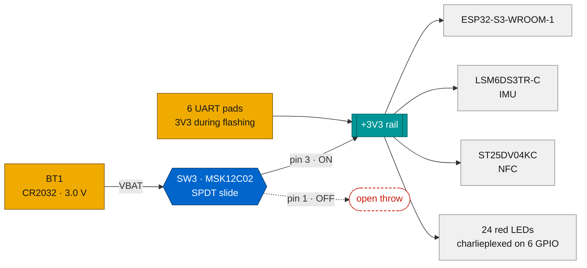

# NeuralCard

[](https://github.com/Brillar0101/NeuralCard/actions/workflows/design-review.yml)
[](https://www.kicad.org/)
[](DESIGN.md)
[](BOM.md)

A business card that runs a neural network.

It's a credit card sized PCB (85.6 x 54 mm, 0.8 mm thick) with an ESP32-S3,
a 6-axis IMU, and 24 LEDs arranged as the network it actually runs: 6 input
neurons, 8 hidden, 10 output. You hold the card, draw a digit in the air,
and the LEDs light with the real activations as the inference runs. The
brightest output neuron is the guess.

The front artwork is the network diagram. The synapse lines are drawn at
three different stroke weights, the way a trained model's weights differ.
The card also has an NFC tag (ST25DV04KC) with a PCB coil antenna, so
tapping it with a phone opens [princetekki.com/card](https://www.princetekki.com/card)
and offers my contact as a vCard. That part works even with a dead battery,
since the tag is powered by the phone's field.


## Hardware

- ESP32-S3-WROOM-1 (radio off, coin cell life)
- LSM6DS3TR-C accelerometer + gyro on I2C. Its six axes map one to one
  onto the six input neurons.
- 24 red LEDs charlieplexed on 6 GPIO, software PWM for the glow
- ST25DV04KC dynamic NFC tag, 9-turn coil etched on the back copper,
  tuned with a single external cap against the chip's internal 28.5 pF
- CR2032 coin cell. No USB connector: you flash once through six UART
  pads with a serial adapter, then it runs on the coin.
- MSK12C02 slide switch (SW3) on the coin's positive terminal, so the card
  has a real off position rather than only a firmware deep sleep.

Runs on a 2-layer board. Everything is assembled by JLCPCB except the coin
cell.

## How it's wired

Power. The coin's positive terminal runs through a real slide switch, so the
card has a hard off rather than only a firmware deep sleep. Pin 2 of SW3 is the
common pole; sliding it the other way parks the coin on a floating contact.


```mermaid
flowchart LR
    BT1["BT1<br/>CR2032 · 3.0 V"] -->|VBAT| SW3{{"SW3 · MSK12C02<br/>SPDT slide"}}
    SW3 -->|"pin 3 · ON"| RAIL[["+3V3 rail"]]
    SW3 -.->|"pin 1 · OFF"| NC(["open throw"])
    PADS["6 UART pads<br/>3V3 during flashing"] --> RAIL
    RAIL --> U1["ESP32-S3-WROOM-1"]
    RAIL --> U2["LSM6DS3TR-C<br/>IMU"]
    RAIL --> U4["ST25DV04KC<br/>NFC"]
    RAIL --> LEDS["24 red LEDs<br/>charlieplexed on 6 GPIO"]

    classDef src fill:#F0AB00,stroke:#795600,color:#151515
    classDef sw fill:#0066CC,stroke:#003366,color:#FFFFFF
    classDef rail fill:#009596,stroke:#005F60,color:#FFFFFF
    classDef load fill:#F0F0F0,stroke:#8A8D90,color:#151515
    classDef off fill:#FFFFFF,stroke:#C9190B,color:#C9190B,stroke-dasharray:4 3
    class BT1,PADS src
    class SW3 sw
    class RAIL rail
    class U1,U2,U4,LEDS load
    class NC off
```

Inference. The six IMU axes map one-to-one onto the six input neurons, and the
LEDs at each node light with the real activations as the net runs.


```mermaid
flowchart LR
    IMU["LSM6DS3TR-C<br/>ax ay az · gx gy gz"] --> IN["INPUT<br/><b>6 neurons</b>"]
    IN --> HID["HIDDEN<br/><b>8 neurons</b>"]
    HID --> OUT["OUTPUT<br/><b>10 neurons</b><br/>digits 0-9"]
    OUT --> GUESS(["brightest neuron<br/>= the guess"])

    classDef sensor fill:#F0AB00,stroke:#795600,color:#151515
    classDef layer fill:#0066CC,stroke:#003366,color:#FFFFFF
    classDef out fill:#5752D1,stroke:#2A265F,color:#FFFFFF
    classDef result fill:#3E8635,stroke:#1F4D19,color:#FFFFFF
    class IMU sensor
    class IN,HID layer
    class OUT out
    class GUESS result
```

All 24 LEDs are driven from 6 GPIO by charlieplexing, which is why there are
6 current-limiting resistors rather than 24.

<!-- kicad-happy:start -->

### Automated design review

`kicad-happy` analysis of the schematic and PCB — **81 findings** raw, **56** after removing rules that do not apply to this board. Regenerated on every push.

<table><tr><td>

| Severity | Count |
|---|---|
| Error | 27 |
| Warning | 5 |
| Info | 49 |
| **Total** | **81** |

</td><td>

**After suppression**

| Severity | Count |
|---|---|
| Error | 3 |
| Warning | 4 |
| Info | 49 |
| **Total** | **56** |

</td></tr></table>

**Open findings**

| Rule | Sev | N | Where | Finding |
|---|---|---|---|---|
| `FD-001` | Error | 2 | pcb | No fiducials on B.Cu (30 SMD components) (finest pad dim 0.28mm — BGA/fine-pitch QFN present) |
| `PM-002` | Error | 2 | pcb | ANT1 is 0.0mm from board edge |
| `SS-001` | Error | 1 | sch | Sourcing blocker: BOM has <50% MPN coverage (0/18 unique parts). Board is not pre-fab ready. |
| `PU-001` | Warning | 1 | sch | U2 pin INT2 (__unnamed_26) missing pull-up resistor |
| `DFM-001` | Warning | 1 | pcb | Annular ring 0.1mm requires advanced process (standard: 0.125mm) |
| `DFM-002` | Warning | 1 | pcb | Via annular ring 0.1mm below IPC Class 2 minimum 0.125mm |
| `LA-AUD` | Info | 24 | sch | LED D1 (red) [resistor_limited] |
| `CP-002` | Info | 8 | pcb | No opposite-layer copper under D1 |
| `DO-DET` | Info | 3 | sch | Decoupling coverage on +3V3 |
| `CC-DET` | Info | 3 | pcb | Power net +3V3: 0.2mm min trace |
| `EP-AUD` | Info | 2 | sch | ESD audit ANT1 (header): none coverage |
| `CERT-001` | Info | 1 | sch | Wireless module detected: U1 |
| `DC-DET` | Info | 1 | sch | Decoupling on +3V3 |
| `DS-003` | Info | 1 | sch | Datasheets present (1 files) but 54/54 BOM parts lack an MPN — those parts can't be cross-referenced. |
| `RC-DET` | Info | 1 | sch | RC filter R9/C4 at 159.15Hz |
| `SI-DET` | Info | 1 | sch | Sensor U2 (LSM6DS3TR-C) [motion/spi] |
| `WL-001` | Info | 1 | sch | wifi/ble module U1 (ESP32-S3-WROOM-1) |
| `LC-007` | Info | 1 | sch | Lifecycle audit not run — --lifecycle flag not passed |
| `TS-DET` | Info | 1 | pcb | Zone stitching: GND 35 vias |

<details><summary><b>Not applicable to this design</b> (25 findings)</summary>

| Rule | Sev | N | Where | Finding |
|---|---|---|---|---|
| `LR-001` | Error | 24 | sch | LED D1: no current-limiting resistor found |
| `TE-001` | Warning | 1 | pcb | Test point coverage: 0/52 nets (0%) |

- `LR-001` — Charlieplexed matrix: R1-R6 limit current on the six shared GPIO drive lines, so no per-LED series resistor exists by design.
- `TE-001` — Business-card form factor; no test points by design.

</details>

Full report: [`docs/design-review.md`](docs/design-review.md)

<!-- kicad-happy:end -->

## The board is generated, not drawn

I didn't lay this out by hand. The whole design is produced by scripts, so
the board can be rebuilt from scratch with:

```
python3 gen_schematic.py                 # writes NeuralCard.kicad_sch
kicad-cli sch export netlist -o NeuralCard.net NeuralCard.kicad_sch
python3 tools/gen_nfc_antenna.py         # writes the coil footprint
<kicad python> place_pcb.py              # places parts, silk art, keepouts
<kicad python> -c "ExportSpecctraDSN"    # then route with freerouting.jar
<kicad python> tools/stitch_islands.py   # ties orphan ground islands
python3 tools/apply_fonts.py             # Red Hat faces on the silk
kicad-cli pcb export gerbers/drill/pos   # fab outputs
```

`<kicad python>` is the interpreter bundled with KiCad, which has `pcbnew`.
Freerouting isn't checked in (it's a 20 MB jar); grab it from
[freerouting/freerouting](https://github.com/freerouting/freerouting) and
drop it in `tools/`.

The silkscreen typography is Red Hat Display, Text, and Mono, the same
faces my website uses. KiCad renders them as outline fonts and they plot
into the gerbers as polygons, so the fab doesn't need the fonts installed.
You do, if you rerun the pipeline: they're in
[RedHatOfficial/RedHatFont](https://github.com/RedHatOfficial/RedHatFont).

## Ordering

The `fab/` folder has the current gerber zip, BOM, and pick and place file.
Order settings that matter: 2 layers, 0.8 mm, matte black mask, ENIG
(the hairline under the name is a mask opening over the ground pour, so it
comes out gold), Standard PCBA. One BOM line, the 62 pF antenna tuning cap,
is marked select-at-order: pick any 0603 NP0 in the 56 to 68 pF range from
their catalog. Check the antenna resonance on the first board with a VNA
before ordering a big batch. The math says 13.6 MHz but copper nearby pulls
it down, and the cap value is the knob.

## Status

Hardware is done and verified: ERC clean, 100% routed, DRC clean. The
firmware (IMU capture, the actual digit model, LED playback) is specced in
DESIGN.md but not written yet, so right now the card is a very elaborate
NFC business card. That part alone already works.

## License

CERN-OHL-P v2. See LICENSE. Do whatever you want with it, attribution
appreciated.
