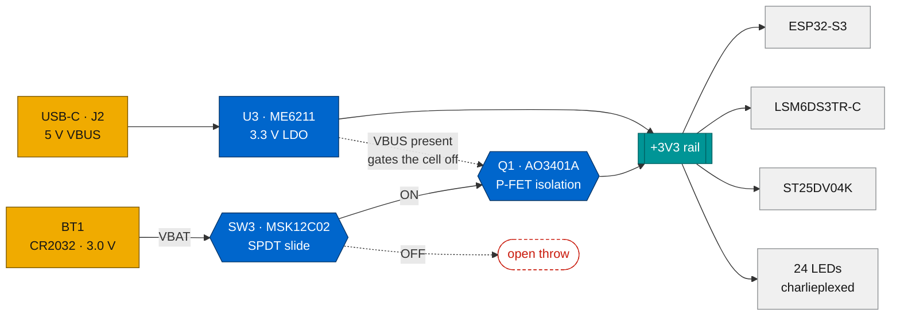
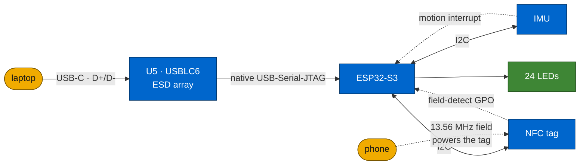
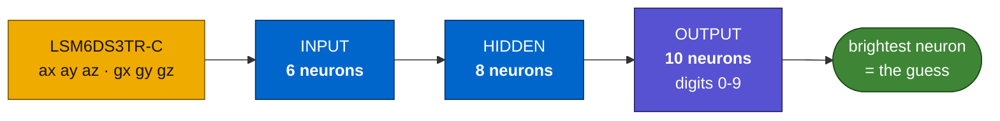

# NeuralCard

[](https://www.kicad.org/)
[](docs/DESIGN.md)
[](docs/drc/README.md)
[](fab/BOM_JLCPCB.csv)
[](CHANGELOG.md)

A business card that runs a neural network.

A credit-card-sized PCB (85.6 x 54 mm) carrying an ESP32-S3, a 6-axis IMU,
and 24 LEDs arranged as the network it actually runs: 6 input neurons,
8 hidden, 10 output. You hold the card, draw a digit in the air, and the
LEDs light with the real activations as inference runs. The brightest
output neuron is the guess.

The front artwork *is* the network diagram — synapse lines drawn at three
stroke weights, the way a trained model's weights differ. The card also
carries an NFC tag with a PCB coil antenna, so tapping a phone opens
[princetekki.com/card](https://www.princetekki.com/card) and offers a vCard.
That works with a dead battery or no battery at all: the tag is powered by
the phone's own RF field.


## Repository layout

| Path | What's in it |
|---|---|
| `hardware/` | KiCad 10 project — schematic, board, custom symbol/footprint libraries, 3D models |
| `fab/` | Manufacturing outputs: gerber zip, drill files, BOM with LCSC part numbers, pick-and-place |
| `firmware/` | ESP-IDF project — charlieplex driver, IMU driver, gesture recorder (builds today) |
| `docs/` | Design rationale, datasheet findings, DRC history, audits, FAQ |
| `render/` | Board renders used above |
| `CHANGELOG.md` | Revision history, newest first |

Start with [`docs/DESIGN.md`](docs/DESIGN.md) for why the board is the way it
is, [`docs/FAQ.md`](docs/FAQ.md) for the questions people actually ask, and
[`docs/drc/README.md`](docs/drc/README.md) for the verification trail.

## Hardware

- **ESP32-S3-WROOM-1-N8R2** — the brain, and the thing running inference
- **LSM6DS3TR-C** accelerometer + gyro on I2C; its six axes map one-to-one
  onto the six input neurons
- **24 red LEDs** charlieplexed on 6 GPIO, software PWM for the glow
- **ST25DV04K** dynamic NFC tag, 9-turn coil etched in the copper, tuned
  with a single external cap (C12) against the chip's internal capacitance
- **USB-C** (v2.3) — native USB on the S3, so a plain cable flashes the board
  and gives a serial console with no adapter. ESD-protected by a USBLC6-2SC6.
- **Dual power** — a CR2032 coin cell through a real slide switch (SW3), or
  USB 5 V through an ME6211 LDO. A P-FET (Q1) isolates the cell whenever USB
  is present, so the board can never try to charge a non-rechargeable cell.

Two-layer board, ground poured on both sides and stitched; every net is a
single connected cluster.

## How it's wired

**Power.** Two sources that can never fight each other.


```mermaid
flowchart LR
    USB["USB-C · J2<br/>5 V VBUS"] --> LDO["U3 · ME6211<br/>3.3 V LDO"]
    BT1["BT1<br/>CR2032 · 3.0 V"] -->|VBAT| SW3{{"SW3 · MSK12C02<br/>SPDT slide"}}
    SW3 -->|"ON"| Q1{{"Q1 · AO3401A<br/>P-FET isolation"}}
    SW3 -.->|"OFF"| NC(["open throw"])
    LDO --> RAIL[["+3V3 rail"]]
    LDO -.->|"VBUS present<br/>gates the cell off"| Q1
    Q1 --> RAIL
    RAIL --> U1["ESP32-S3"]
    RAIL --> U2["LSM6DS3TR-C"]
    RAIL --> U4["ST25DV04K"]
    RAIL --> LEDS["24 LEDs<br/>charlieplexed"]

    classDef src fill:#F0AB00,stroke:#795600,color:#151515
    classDef sw fill:#0066CC,stroke:#003366,color:#FFFFFF
    classDef rail fill:#009596,stroke:#005F60,color:#FFFFFF
    classDef load fill:#F0F0F0,stroke:#8A8D90,color:#151515
    classDef off fill:#FFFFFF,stroke:#C9190B,color:#C9190B,stroke-dasharray:4 3
    class USB,BT1 src
    class SW3,Q1,LDO sw
    class RAIL rail
    class U1,U2,U4,LEDS load
    class NC off
```

**Data.** USB-C is both power and a programming port; NFC is independent of
both and needs no power of its own.


```mermaid
flowchart LR
    HOST(["laptop"]) -->|"USB-C · D+/D-"| ESD["U5 · USBLC6<br/>ESD array"]
    ESD -->|"native USB-Serial-JTAG"| U1["ESP32-S3"]
    U1 <-->|I2C| U2["IMU"]
    U1 <-->|I2C| U4["NFC tag"]
    U2 -.->|"motion interrupt"| U1
    U4 -.->|"field-detect GPO"| U1
    PHONE(["phone"]) -.->|"13.56 MHz field<br/>powers the tag"| U4
    U1 --> LEDS["24 LEDs"]

    classDef ext fill:#F0AB00,stroke:#795600,color:#151515
    classDef chip fill:#0066CC,stroke:#003366,color:#FFFFFF
    classDef out fill:#3E8635,stroke:#1F4D19,color:#FFFFFF
    class HOST,PHONE ext
    class ESD,U1,U2,U4 chip
    class LEDS out
```

**Inference.** The six IMU axes feed the six input neurons; LEDs at each node
light with the real activations as the network runs.


```mermaid
flowchart LR
    IMU["LSM6DS3TR-C<br/>ax ay az · gx gy gz"] --> IN["INPUT<br/><b>6 neurons</b>"]
    IN --> HID["HIDDEN<br/><b>8 neurons</b>"]
    HID --> OUT["OUTPUT<br/><b>10 neurons</b><br/>digits 0-9"]
    OUT --> GUESS(["brightest neuron<br/>= the guess"])

    classDef sensor fill:#F0AB00,stroke:#795600,color:#151515
    classDef layer fill:#0066CC,stroke:#003366,color:#FFFFFF
    classDef out fill:#5752D1,stroke:#2A265F,color:#FFFFFF
    classDef result fill:#3E8635,stroke:#1F4D19,color:#FFFFFF
    class IMU sensor
    class IN,HID layer
    class OUT out
    class GUESS result
```

All 24 LEDs run from 6 GPIO by charlieplexing — which is why there are 6
current-limiting resistors rather than 24, and why the display is viable on
a coin cell: only one LED is ever actually lit at a time.

## Firmware

`firmware/` is an ESP-IDF project that builds today. It contains the
charlieplex driver (LED-to-pin mapping extracted from the board netlist),
the LSM6DS3 driver, and a motion-triggered gesture recorder that prints
labelled CSV over the USB-C console — the tool for building a training set.

```
cd firmware && idf.py set-target esp32s3 && idf.py build && idf.py flash monitor
```

The neural network itself is deliberately not in the repo yet: it has to be
trained on gestures recorded from real hands, which needs assembled boards.
See [`firmware/README.md`](firmware/README.md).

## Ordering

Everything a fab needs is in `fab/`: `NeuralCard_JLCPCB.zip` (gerbers +
drill), `BOM_JLCPCB.csv` (LCSC part numbers), `NeuralCard-cpl.csv`
(placements).

**Build spec:** 2 layers, **1.6 mm** standard thickness, green soldermask,
HASL — the cheap prototype configuration, currently about $2 for five boards.

Two finishes worth knowing about if you make a batch to actually hand out:
**0.8 mm** feels like a card rather than a circuit board, and **ENIG** turns
the hairline under the name gold (it is a mask opening over the ground pour,
so on HASL it comes out tin-coloured). Both cost more; neither changes the
gerbers, they are order-time options.

**Two build routes:**

- *Hand assembly* — order bare boards plus a solder-paste stencil, buy parts
  from LCSC. Cheapest, and the stencil makes the LGA-14 IMU tractable.
- *Factory assembly* — JLCPCB Standard PCBA, both sides. Adds roughly $100
  of fixed setup/feeder overhead, so it only makes sense at 30+ boards.

Two BOM notes: **C12** (NFC tuning) ships as 68 pF and should be re-tuned
against the built coil — read range is the practical test. The NFC chip is
specified as **ST25DV04K-IER6S3**, a stock-availability substitute for the
original KC variant; same package, pinout and function.

## Status

**Hardware: done and verified at v2.3.1** — DRC 0 violations, 0 unconnected,
ERC 0, every net a single connected cluster, all footprints datasheet-checked.
Never fabricated yet: these files would produce the first physical boards.

**Firmware: scaffold builds** — drivers and gesture capture work; the trained
model is the remaining work, and it needs boards first.

So today the card is a very elaborate NFC business card — and that part
already works the moment the tag is programmed.

## License

CERN-OHL-P v2. See [LICENSE](LICENSE). Do whatever you want with it,
attribution appreciated.
