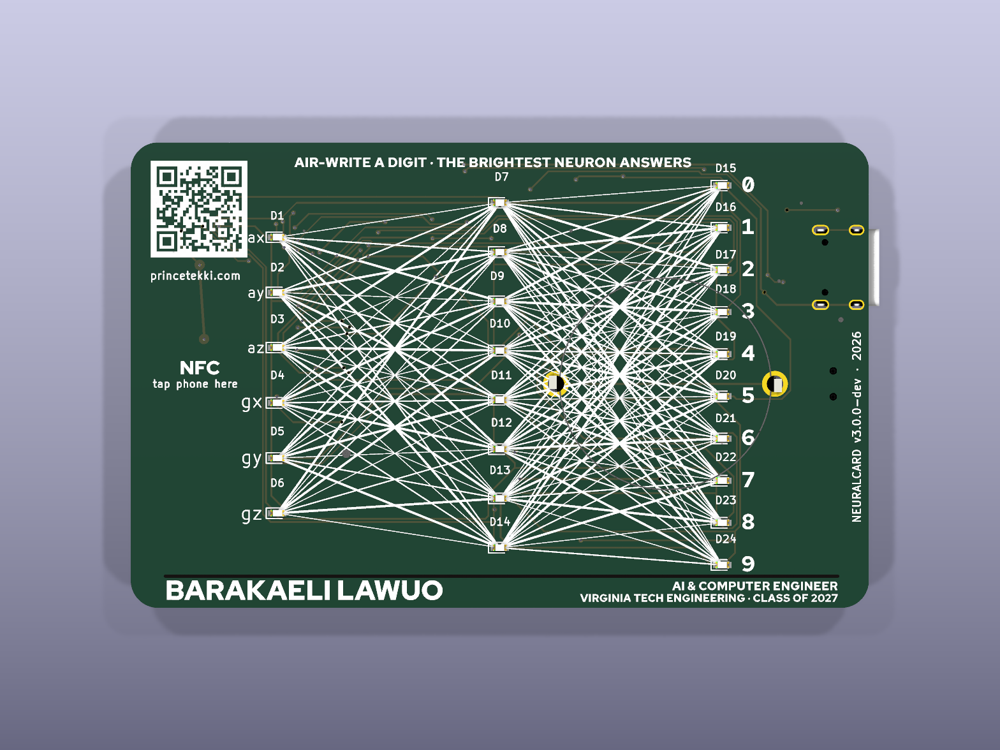
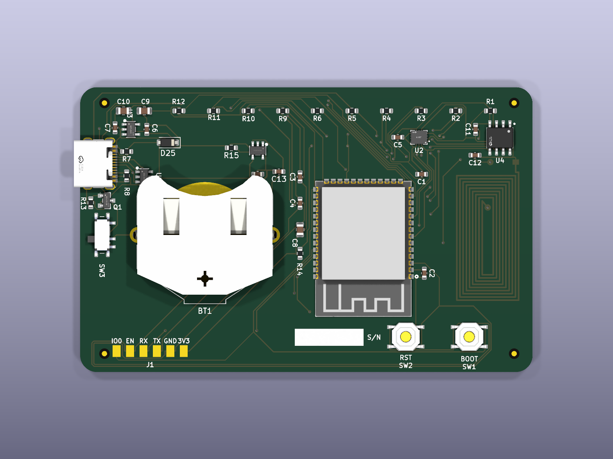
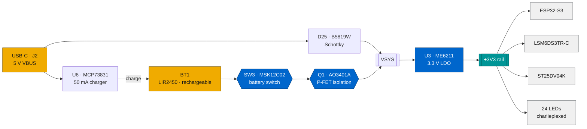
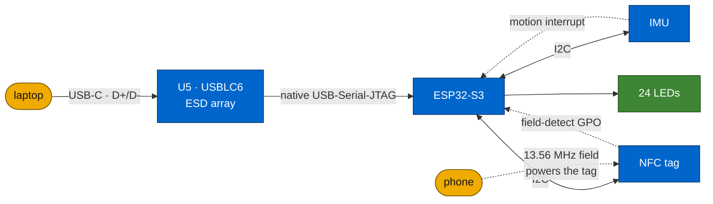
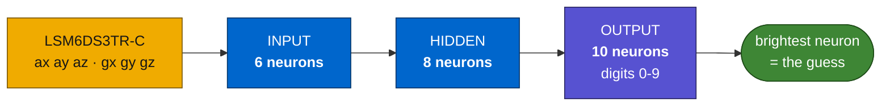

# NeuralCard

[](https://www.kicad.org/)
[](docs/DESIGN.md)
[](docs/drc/v3.0.1-dev-verification.md)
[](fab/BOM_PCBWay.csv)
[](CHANGELOG.md)

A business card that runs a neural network.

> This is the sponsorship build, a fork of
> [NeuralCard](https://github.com/Brillar0101/NeuralCard) prepared for assembly by
> PCBWay. The BOM has been rewritten from JLCPCB and LCSC part codes into
> manufacturer part numbers PCBWay can quote, with approved alternates where a swap
> is safe and do-not-substitute rules where it is not. Revision v3.0.1-dev corrects
> the BOOT and RESET switch pad mapping after the prototype showed IO0/EN shorted to
> ground. This is still a development board: its latest DRC reports 410 violations
> and 191 schematic-parity issues. See the [verification report](docs/drc/v3.0.1-dev-verification.md)
> before using or fabricating this revision.

It is a credit-card-sized PCB, 85.6 by 54 mm, carrying an ESP32-S3, a 6-axis
IMU, and 24 LEDs laid out as the network it actually runs: 6 input neurons,
8 hidden, 10 output. You hold the card, draw a digit in the air, and the LEDs
light with the real activations as inference runs. Brightest output neuron
wins.

The front artwork is the network diagram. The synapse lines are drawn at three
stroke weights, the way a trained model's weights differ. There is also an NFC
tag with a coil antenna etched into the copper, so tapping a phone opens
[princetekki.com/card](https://www.princetekki.com/card) and offers a vCard.
That works with a dead battery, or no battery at all, because the phone's own
field powers the tag.




## Repository layout

| Path | What's in it |
|---|---|
| `hardware/` | KiCad 10 project: schematic, board, custom symbol and footprint libraries, 3D models |
| `fab/` | Manufacturing outputs: Gerber zip, drill files, pick-and-place, and three BOM/order files for PCBWay, JLCPCB, and LCSC |
| `firmware/` | ESP-IDF project. Charlieplex driver, IMU driver, gesture recorder. Builds today. |
| `docs/` | Design rationale, component sourcing, datasheet findings, DRC history, audits, FAQ |
| `hardware/datasheets/` | Component datasheets indexed to the v3.0.1-dev BOM |
| `render/` | The board renders used above |
| `CHANGELOG.md` | Revision history, newest first |

Start with [`docs/DESIGN.md`](docs/DESIGN.md) for why the board is shaped the
way it is, [`docs/FAQ.md`](docs/FAQ.md) for the questions people actually ask,
and [`docs/drc/README.md`](docs/drc/README.md) for the verification trail.

## Hardware

An ESP32-S3-WROOM-1-N8R2 does the thinking and runs the inference. An
LSM6DS3TR-C accelerometer and gyro sits on I2C, and its six axes map one to one
onto the six input neurons. The 24 red LEDs are charlieplexed across 6 GPIO
with software PWM for the glow.

For the business-card half there is an ST25DV04K dynamic NFC tag with a 9-turn
coil in the copper, tuned by a single external cap (C12) against the chip's
internal capacitance.

USB-C arrived in v2.3. The S3 has native USB, so a plain cable flashes the
board and gives a serial console without an adapter. A USBLC6-2SC6 protects the
data pair.

Power comes from a rechargeable LIR2450 coin cell or USB-C. U6 charges the cell
from USB at 50 mA; D25 and Q1 feed the VSYS node, and U3 regulates VSYS to 3.3 V.
Use a rechargeable LIR2450 only. Do not install a primary CR2450 on the charger.

Two copper layers with filled GND pours, set 0.5 mm inside the rounded board
edge. The latest development-board checks still report electrical and
schematic-parity issues; see the verification record before treating any net or
layout as fabrication-ready.

## How it's wired

Power and charging paths.


```mermaid
flowchart LR
    USB["USB-C · J2<br/>5 V VBUS"] --> D25["D25 · B5819W<br/>Schottky"]
    D25 --> VSYS[["VSYS"]]
    USB --> U6["U6 · MCP73831<br/>50 mA charger"]
    U6 -->|"charge"| BT1["BT1<br/>LIR2450 · rechargeable"]
    BT1 --> SW3{{"SW3 · MSK12C02<br/>battery switch"}}
    SW3 --> Q1{{"Q1 · AO3401A<br/>P-FET isolation"}}
    Q1 --> VSYS
    VSYS --> LDO["U3 · ME6211<br/>3.3 V LDO"]
    LDO --> RAIL[["+3V3 rail"]]
    RAIL --> U1["ESP32-S3"]
    RAIL --> U2["LSM6DS3TR-C"]
    RAIL --> U4["ST25DV04K"]
    RAIL --> LEDS["24 LEDs<br/>charlieplexed"]

    classDef src fill:#F0AB00,stroke:#795600,color:#151515
    classDef sw fill:#0066CC,stroke:#003366,color:#FFFFFF
    classDef rail fill:#009596,stroke:#005F60,color:#FFFFFF
    classDef load fill:#F0F0F0,stroke:#8A8D90,color:#151515
    classDef off fill:#FFFFFF,stroke:#C9190B,color:#C9190B,stroke-dasharray:4 3
    class USB,BT1 src
    class SW3,Q1,LDO sw
    class RAIL rail
    class U1,U2,U4,LEDS load
    class NC off
```

Then data. USB-C carries both power and programming. NFC is independent of
both and needs no power of its own.


```mermaid
flowchart LR
    HOST(["laptop"]) -->|"USB-C · D+/D-"| ESD["U5 · USBLC6<br/>ESD array"]
    ESD -->|"native USB-Serial-JTAG"| U1["ESP32-S3"]
    U1 <-->|I2C| U2["IMU"]
    U1 <-->|I2C| U4["NFC tag"]
    U2 -.->|"motion interrupt"| U1
    U4 -.->|"field-detect GPO"| U1
    PHONE(["phone"]) -.->|"13.56 MHz field<br/>powers the tag"| U4
    U1 --> LEDS["24 LEDs"]

    classDef ext fill:#F0AB00,stroke:#795600,color:#151515
    classDef chip fill:#0066CC,stroke:#003366,color:#FFFFFF
    classDef out fill:#3E8635,stroke:#1F4D19,color:#FFFFFF
    class HOST,PHONE ext
    class ESD,U1,U2,U4 chip
    class LEDS out
```

And inference. The six IMU axes feed the six input neurons, and the LEDs at
each node light with the real activations as the network runs.


```mermaid
flowchart LR
    IMU["LSM6DS3TR-C<br/>ax ay az · gx gy gz"] --> IN["INPUT<br/><b>6 neurons</b>"]
    IN --> HID["HIDDEN<br/><b>8 neurons</b>"]
    HID --> OUT["OUTPUT<br/><b>10 neurons</b><br/>digits 0-9"]
    OUT --> GUESS(["brightest neuron<br/>= the guess"])

    classDef sensor fill:#F0AB00,stroke:#795600,color:#151515
    classDef layer fill:#0066CC,stroke:#003366,color:#FFFFFF
    classDef out fill:#5752D1,stroke:#2A265F,color:#FFFFFF
    classDef result fill:#3E8635,stroke:#1F4D19,color:#FFFFFF
    class IMU sensor
    class IN,HID layer
    class OUT out
    class GUESS result
```

All 24 LEDs run from 6 GPIO by charlieplexing. That is why there are 6
current-limiting resistors rather than 24, and why the display works on a coin
cell at all: only one LED is ever actually lit.

## Firmware

`firmware/` is an ESP-IDF project that builds today. It has the charlieplex
driver, with the LED-to-pin mapping extracted from the board netlist rather
than guessed, the LSM6DS3 driver, and a motion-triggered gesture recorder that
prints labelled CSV over the USB-C console. That recorder is how you build a
training set.

```
cd firmware && idf.py set-target esp32s3 && idf.py build && idf.py flash monitor
```

The neural network itself is deliberately not in the repo yet: it has to be
trained on gestures recorded from real hands, which needs assembled boards.
See [`firmware/README.md`](firmware/README.md).

## Ordering

Everything a fab needs is in `fab/`: `NeuralCard_gerbers.zip` (gerbers +
drill), `NeuralCard-cpl.csv` (placements), and a BOM. Use
`BOM_PCBWay.csv` for this build, which carries manufacturer part numbers,
approved alternates, and per-line substitution rules. `BOM_JLCPCB.csv` is the
upstream file and is keyed to LCSC codes instead.

Build spec: 2 layers, 1.6 mm thickness, green soldermask, HASL. That is the
cheap prototype configuration, currently about $2 for five boards.

Two finish options are worth knowing about if you ever make a batch to hand
out. At 0.8 mm the board feels like a card instead of a circuit board. With
ENIG, the hairline under the name comes out gold, since it is a mask opening
over the ground pour and plates with whatever finish you pick. Both cost more.
Neither changes the gerbers, so they are order-time choices.

**Two build routes:**

Hand assembly means ordering bare boards plus a solder-paste stencil and
buying parts from LCSC. It is the cheapest route, and the stencil is what makes
the LGA-14 IMU tractable with hot air.

Factory assembly means turnkey PCBA on both sides. It adds roughly $100 of fixed
setup and feeder cost at a typical prototype house, so it only pays off around 30
boards or more. This build is being assembled by PCBWay under sponsorship, so see
[`docs/SOURCING.md`](docs/SOURCING.md) for how the parts are actually bought.

Two BOM notes. C12, the NFC tuning cap, ships as 68 pF and should be retuned
against the coil once it exists. Read range is the practical test. The NFC chip
is ST25DV04KC-IE6S3, which is the active part. The older ST25DV04K-IER6S3 is
marked not recommended for new designs but is still widely stocked, and it is
listed as the approved fallback: same package, same pinout, same function.

## Status

The released v2.3.1 tag is unchanged. The working v3.0.1-dev revision corrects
the tactile-switch pad assignment that grounded BOOT and RESET on the prototype.
Its DRC reports 410 violations, 191 schematic-parity issues, and 0 unconnected
items; ERC reports 42 library-configuration warnings. It is not ready for
fabrication. See [`docs/drc/v3.0.1-dev-verification.md`](docs/drc/v3.0.1-dev-verification.md)
for the full reports and [`hardware/datasheets/README.md`](hardware/datasheets/README.md)
for the component document index.

The firmware scaffold builds. Drivers and gesture capture work. The trained
model is the remaining piece, and it needs assembled boards before it can
exist.

So today the card is a very elaborate NFC business card, and that part works
the moment the tag is programmed.

## License

CERN-OHL-P v2. See [LICENSE](LICENSE). Do whatever you want with it,
attribution appreciated.
